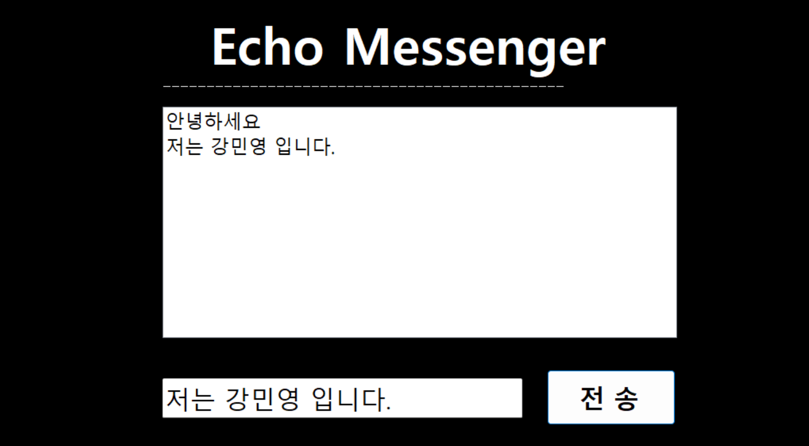
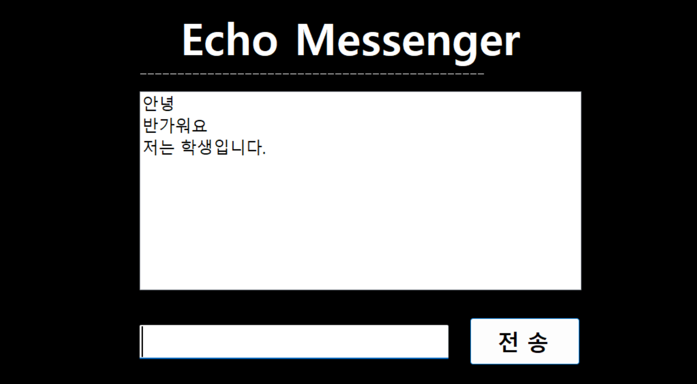
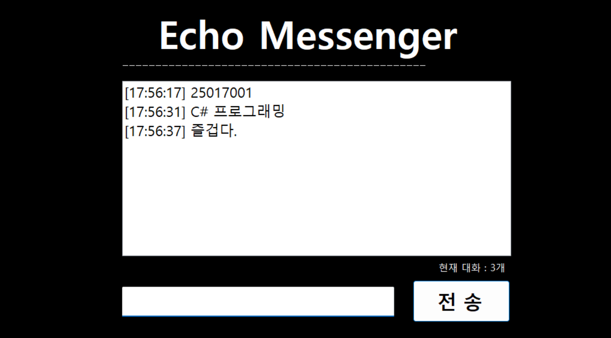
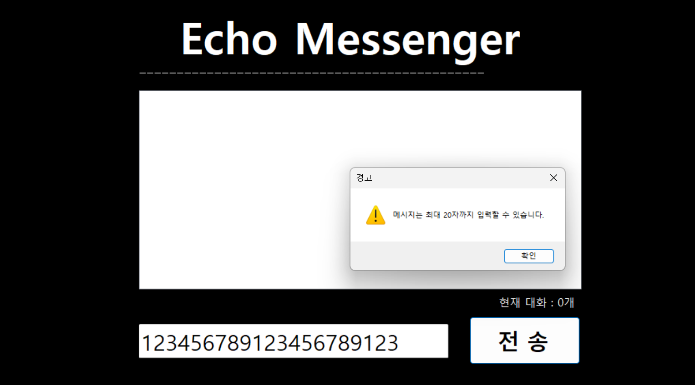

# (C# 코딩) EchoMessenger

## 개요
- C# 프로그래밍 학습
- 1줄 소개: 사용자 키보드 입력을 받아서 처리하는 프로그램
- 사용한 플랫폼:
  - C#, .NET Windows Forms, Visual Studio, GitHub
- 사용한 컨트롤:
  - Label, TextBox, ListBox, Button
- 사용한 기술과 구현한 기능:
  - Visual Studio를 이용하여 UI 디자인
  - string 클래스를 이용한 사용자 입력 데이터 처리
  - DateTime 클래스를 이용한 현재시간 정보 구하기
	
- 수업 중에 배우고 사용했던 클래스들 관련된 설명
  - string 클래스: 사용자가 입력한 문자열 데이터를 저장하고 처리하기 위해 사용하였다. 특히 Trim() 함수를 활용하여 문자열의 앞뒤 공백을 제거하였다.
  - DateTime 클래스: 현재 시간을 가져오기 위해 사용하였으며, 메시지 전송 시 시간 정보를 함께 출력하는 기능을 구현하였다.
  - ListBox 클래스: 여러 개의 메시지를 리스트 형태로 출력하기 위해 사용하였으며, Items.Add()를 통해 항목을 추가하였다.
  - TextBox 클래스: 사용자로부터 텍스트 입력을 받기 위해 사용하였다.
  - Button 클래스: 클릭 이벤트를 통해 메시지를 전송하는 기능을 구현하였다.
  - Label 클래스: 메시지 개수와 같은 정보를 사용자에게 표시하기 위해 사용하였다.

- 실습 중에 구현한 기능들 설명
  - 사용자가 입력한 메시지를 ListBox에 추가하는 기본 채팅 기능을 구현하였다.
  - 전송 후 TextBox를 Clear()하여 입력창을 초기화하였다.
  - Enter 키 입력을 통해 버튼 클릭 없이도 메시지를 전송할 수 있도록 KeyDown 이벤트를 활용하였다.
  - 공백 또는 빈 문자열 입력 시 메시지가 전송되지 않도록 조건문을 통해 예외 처리를 구현하였다.
  - 메시지에 현재 시간을 추가하여 출력하는 기능을 구현하였다.
  - ListBox에 저장된 메시지 개수를 계산하여 Label에 실시간으로 표시하는 기능을 구현하였다.

## 실행 화면 (과제1)
- 과제1 코드의 실행 스크린샷

- 과제 내용
  - Label(표시), TextBox(입력), Button(전송), ListBox(대화창)를 적절히 배치합니다.
  - 전송 버튼 클릭 시 TextBox의 텍스트를 ListBox의 항목(Items)으로 추가합니다.

- 구현 내용과 기능 설명
  - 입력창에 메시지 입력하고 전송 버튼을 누르면 메시지가 리스트 박스에 표시된다.
	
## 실행 화면 (과제2)
- 과제2 코드의 실행 스크린샷

- 과제 내용
  - 추가 직후 TextBox의 내용을 비워(Clear) 다음 입력을 준비합니다.
  - 전송 후에 마우스로 다시 입력창을 클릭하지 않아도 되도록 커서를 자동으로 입력창에 둡니다.
  - 마우스 클릭 대신 키보드의 Enter 키로도 메시지를 전송할 수 있도록 합니다.
  - 내용이 없는 빈 문자열이나 공백만 입력된 경우에는 메시지를 전송하지 않도록 합니다.

- 구현 내용과 기능 설명
  - 입력창에 메시지를 입력 후 엔터키를 누르면 메시지를 전송한다.
  - 입력창에 메시지를 입력 후 전송 버튼을 누르면 메시지를 전송한다.
  - 입력창에 공백 혹은 아무것도 입력하지 않을시 버튼 혹은 엔터키를 눌러도 메시지가 전송되지 않는다.

## 실행 화면 (과제3)
- 과제3 코드의 실행 스크린샷

- 과제 내용
  - 메시지 앞에 현재 시간을 자동으로 결합하여 리스트에 출력합니다
  - 현재 리스트에 쌓인 총 메시지 개수를 계산하여 하단의 Label에 표시합니다.
  - 사용자가 입력한 메시지의 앞뒤 부분의 공백을 제거(Trim)하여 처리합니다.

- 구현 내용과 기능 설명
  - 메시지를 입력하면 ListBox에 메시지 앞에 현재 시간이 자동으로 결합되어 출력된다.
  - ListBox 밑에 lblMsgCount 라는 Label이 있는데, 메시지를 입력할 때마다 LisCtBox에 쌓인 총 메시지 개수를 계산하여 lblMsgCount에 표시한다.
  - Trinm() 함수를 이용하여 사용자가 입력한 메시지의 앞뒤 부분의 공백을 제거하여 처리한다.

## 실행 화면 (과제4)
- 과제4 코드의 실행 스크린샷

- 과제 내용
  - 글자수 제한

- 구현 내용과 기능 설명
  - 20자 이상 메시지를 입력하면 경고창을 띄움